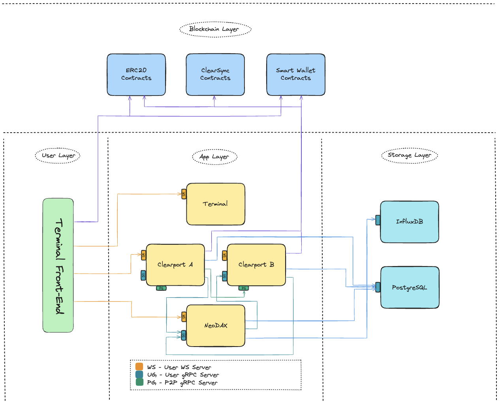

# Yellow Stack

## Introduction

Welcome to the **Yellow Stack** repository. The primary goal of this repository is to host Helm charts for a comprehensive applications stack deployment, streamlining the process of deploying and managing applications in Kubernetes environments. This repository aims to provide a centralized resource for all necessary deployment assets and instructions.

As the project evolves, we anticipate expanding the scope of this repository to include additional tools, utilities, and documentation to support a wider range of deployment scenarios and operational tasks.

## Architecture

The **Yellow Stack** is designed as a multi-layered architecture that facilitates interaction with blockchain smart contracts, application services, and data storage. This architecture ensures a separation of concerns, allowing for modular development and scalability.

The architecture diagram illustrates the interconnectivity and data flow between each layer and component within the Yellow Stack, ensuring a cohesive and scalable infrastructure.

### User Layer

- **Terminal Front-End**: The user interface that clients interact with, providing a seamless and responsive experience to access the functionalities offered by the Terminal application.

### App Layer

Central to user interaction, this layer contains the applications that provide the stack's core functionality:

- **Terminal**: Acts as the interface to the blockchain, allowing users to perform actions on smart contracts and retrieve data.
- **Clearport A & B**: Represent instances of the Clearport application that handle specific business logic, interfacing with the blockchain layer and possibly serving distinct user segments or functions.
- **NeoDAX**: An application possibly geared towards data exchange or analytics, interfacing with the blockchain for data that may involve trading or financial analysis.

#### Servers and Communication

The system leverages different server types to handle communication protocols:

- **WS (WebSocket Server)**: Facilitates real-time, bi-directional communication between the client's front-end and the server for a reactive user interface.
- **UG (User gRPC Server)**: Employs gRPC for efficient, low-latency communication between user interfaces and services, enhancing the responsiveness of user-related interactions.
- **PG (Peer-to-peer gRPC Server)**: Utilizes gRPC for peer-to-peer communication within the distributed network, crucial for blockchain operations and data synchronization.

### Blockchain Layer

This layer contains the smart contracts that our applications interact with:

- **ERC20 Contracts**: Token contracts compliant with the ERC20 standard, used to issue and manage fungible tokens within the ecosystem.
- **ClearSync Contracts**: Custom smart contracts tailored for synchronization processes across different components and blockchain state.
- **Smart Wallet Contracts**: Contracts that enable advanced wallet functionalities like automated transactions and enhanced security protocols.

### Storage Layer

Responsible for data persistence and management, the storage layer comprises:

- **InfluxDB**: A specialized time-series database optimized for high-write loads and real-time analytics, storing time-stamped data from various applications.
- **PostgreSQL**: A robust and flexible relational database managing structured data, with powerful query capabilities to support complex data retrieval needs.

## Clearport

The Clearport application is designed to [...description of what Clearport does and its role in the stack...]. To deploy Clearport using the provided Helm chart, follow these steps:

1. [...Step 1...]
2. [...Step 2...]
3. [...Additional steps...]

## Neodax

Neodax is a [...description of Neodax, its purpose, and how it integrates with the rest of the stack...]. Deployment instructions are as follows:

1. [...Step 1...]
2. [...Step 2...]
3. [...Additional steps...]

## Terminal

Terminal serves as [...description of Terminal's functionality and its importance in the stack...]. To deploy Terminal, use the following steps:

1. [...Step 1...]
2. [...Step 2...]
3. [...Additional steps...]

<!-- ## Contributing

We welcome contributions to the Yellow Stack repository! If you have suggestions, improvements, or new features to add, please feel free to submit an issue or a pull request. For more details on how to contribute, please refer to our CONTRIBUTING.md file. -->

<!-- ## License

This project is licensed under the [...License Name...], which means [...brief description of the license and what it allows users to do...]. -->
